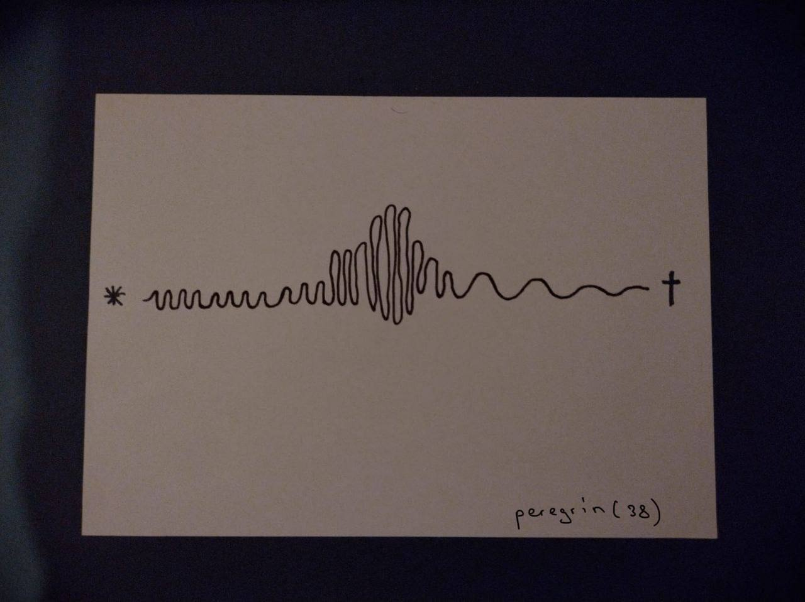

## How people relate to time depending on age

- 2022-10-27

If we summarize the data from the interviews, then for the older generation, time is a marker that determines events. Something that helps define the point of being. In the responses of the younger generation, time is a resource that will never be enough, time scares them. I asked several people to draw how they see time to collect more data on the subject. Based on the data I have at the moment, my story may start in a world where time flows differently depending on the character you choose (child(?), teenager, adult, old person(?)). And use the data obtained from the drawings as material for creating a "landscape" of the world of my history.
(?)* not enough information

