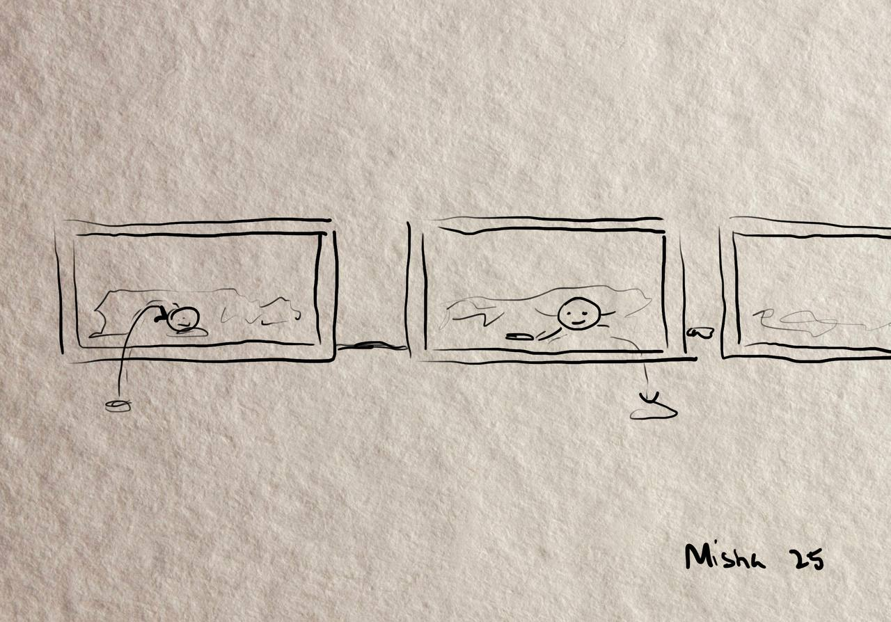

## What if my time was yours

- 2022-11-03

My scope is what happaned when we experienced some other feelings of times:

Silas - 4 
Hey, I’m Silas. I’m 4 years old. I have a lot of time, a whole hundred hours! I have time to play with the fire truck, and go to the station to see the arrival of the train, and check if all is well with the neighbor's cows. My time goes very slowly, and I have time to do everything I want!

More scope [here](https://github.com/MariiaGulkova/head-md-time-in-time-out/blob/main/process/scopes.md)

Twine [here](https://github.com/MariiaGulkova/head-md-time-in-time-out/blob/main/Prototypes/twine/what%20if%20i%20were%20you.html)

