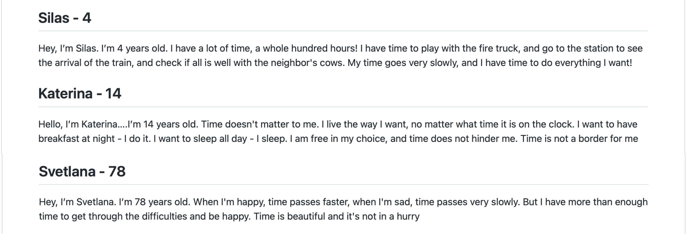

## Traveling with time

- 2022-11-28

Going on a journey, you will meet different people and their vision of time, you will understand that time flows differently for everyone. Immerse yourself in history, because each vision of time is unique

Twine [here](https://github.com/MariiaGulkova/head-md-time-in-time-out/tree/main/Prototypes/twine)