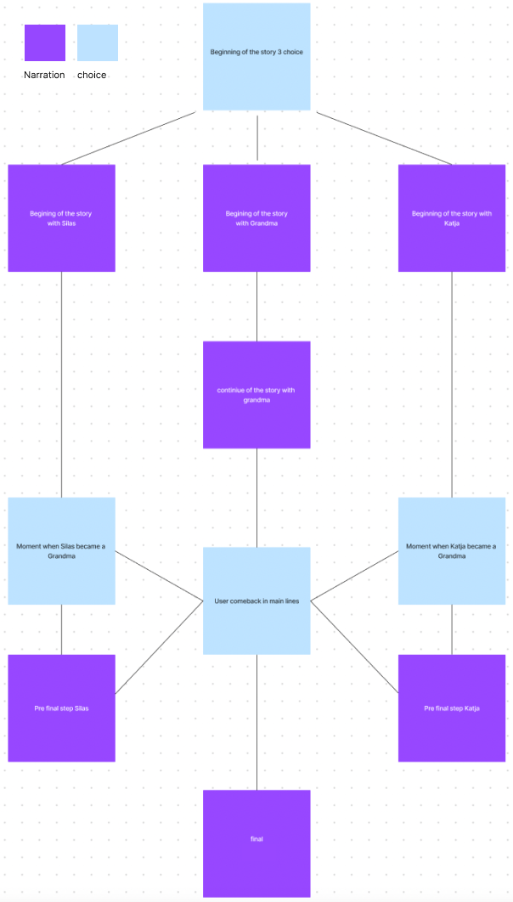

## Time travellers
08.12.2022

By turning your hand, you open the doors to the world of stories. Immerse yourself in the worlds of storytellers, feel their rhythm of time, help them get to the end point of the story

Twine [here](https://github.com/MariiaGulkova/head-md-time-in-time-out/tree/main/Prototypes/twine)
