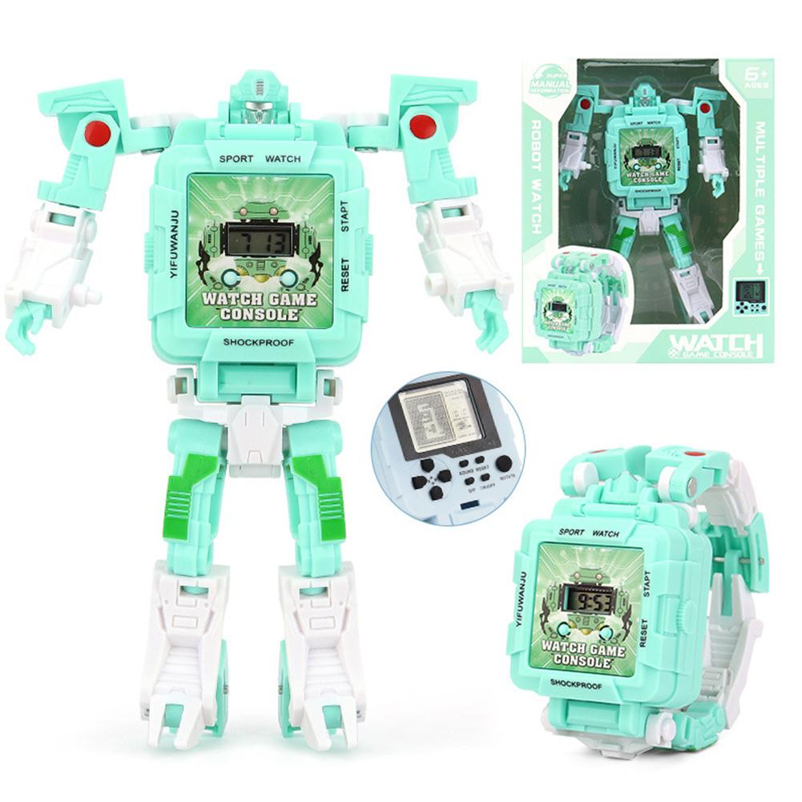

## Time travelers 

The idea is to make a puppet theater inside the gadget, which will be accompanied at certain points in the plot by vibration, light, and may be sound

The main part of the body will be on the wrist, ((while the other can be squeezed in the hand(maybe))

Which materials would you like to use? - silicon or plastic

Possible output - light/vibration/warm/voice
Possible input - ?????? (choice in a story)

