## Time travelers 

### 2022-12-3-4

// Update Scope

Silas - 4

Hey, I’m Silas. I’m 4 years old. I have a lot of time, a whole hundred hours! I have time to play with the fire truck, and go to the station to see the arrival of the train, and check if all is well with the neighbor's cows. My time goes very slowly, and I have time to do everything I want!

Katerina - 14

Hello, I’m Katerina….I’m 14 years old. Time doesn't matter to me. I live the way I want, no matter what time it is on the clock. I want to have breakfast at night - I do it. I want to sleep all day - I sleep. I am free in my choice, and time does not hinder me. Time is not a border for me

Svetlana - 78

Hey, I’m Svetlana. I’m 78 years old. When I'm happy, time passes faster, when I'm sad, time passes very slowly. But I have more than enough time to get through the difficulties and be happy. Time is beautiful and it's not in a hurry //

### The idea is to make a puppet theater inside the gadget, which will be accompanied at certain points in the plot by vibration, light, and may be sound

The main part of the body will be on the wrist, ((while the other can be squeezed in the hand(maybe))

Which materials would you like to use? - silicon or plastic

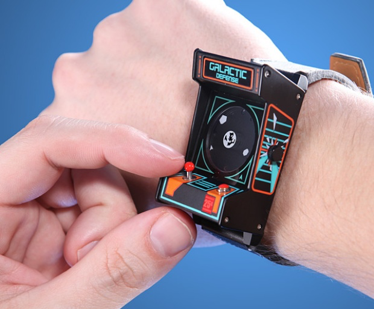
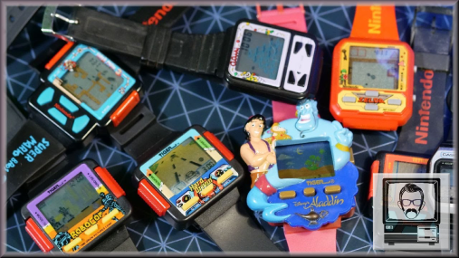
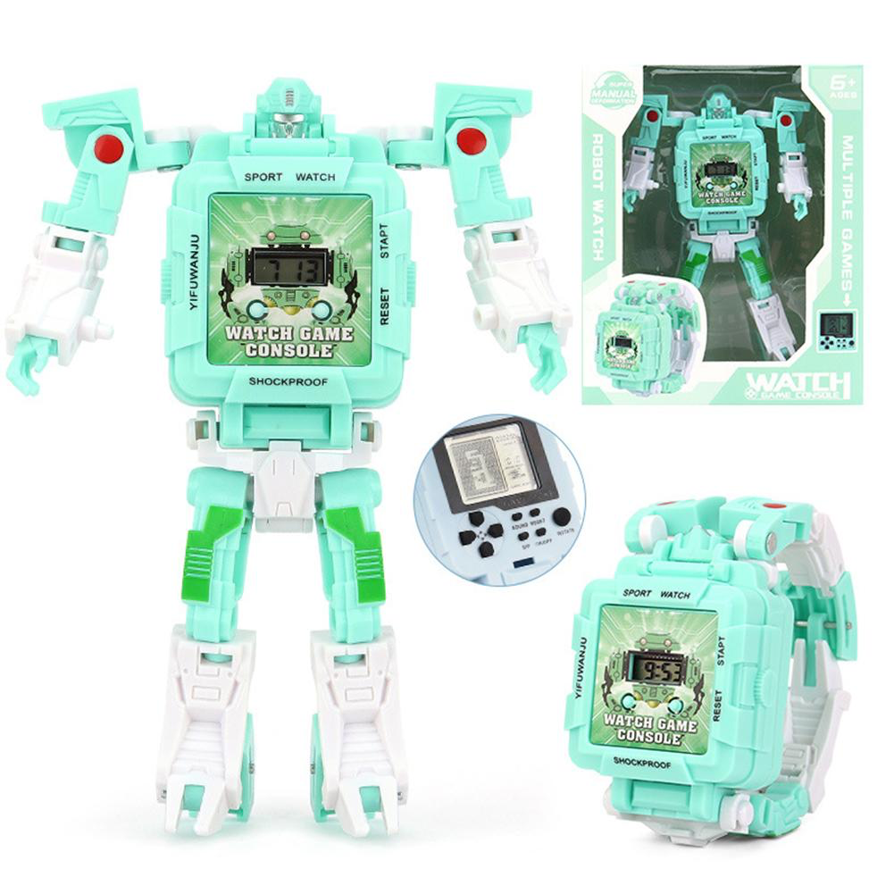
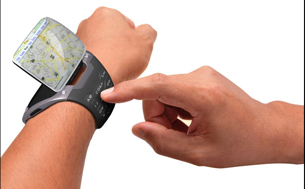
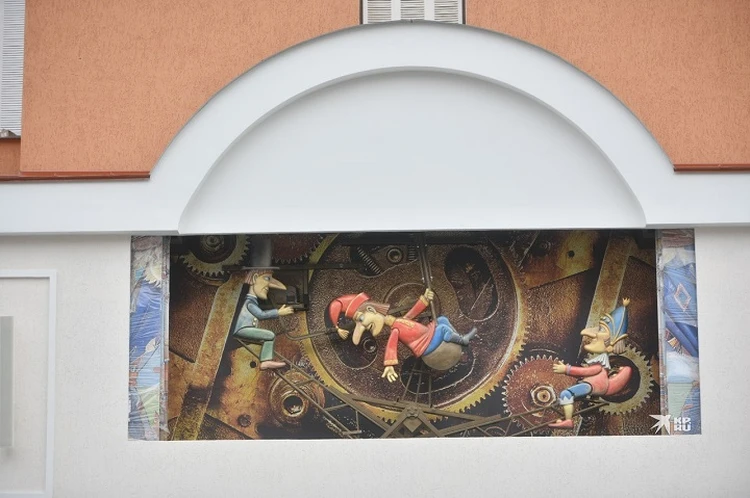

Possible output - light/vibration/warm/voice
Possible input - ?????? (choice in a story)

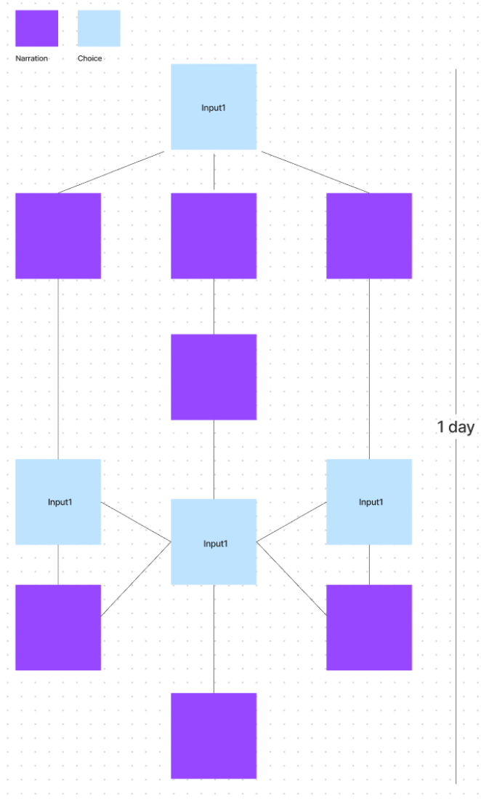

puppet theatre:

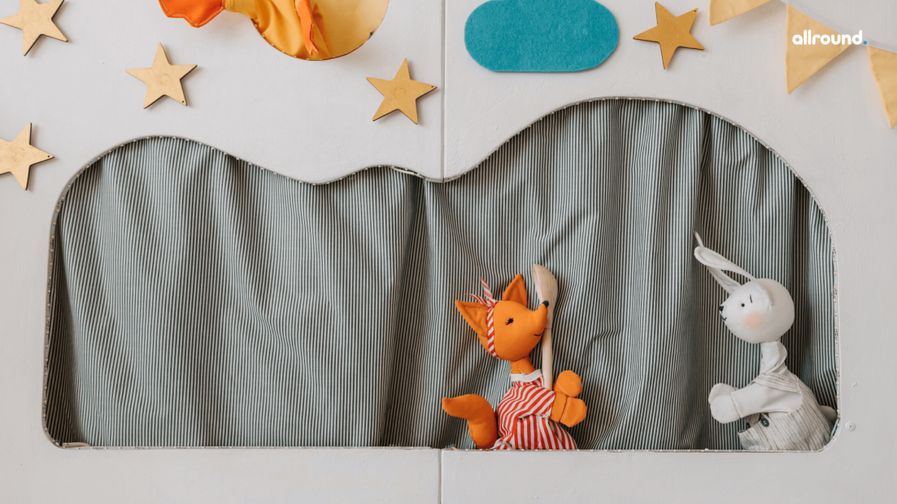
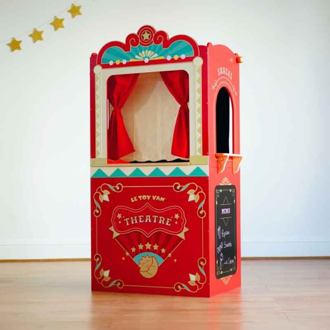

### 2022-12-5

- My output will be the voice, and to show a special rhythm for each story, i will use intonation and special sounds ( like vrrr or bruuum for silas) load, quit etc
- For voice reproduction in Arduino I will use MP3 arduino (or analogy) (or put in arduino small SD or put it somehow in Code(maybe better SD))
- Should make twine for my voice story
- My input - ?
- My shape - ?
- (the light of the indicators depends on the intensity of the voice (from attenuation to bright and vice versa)(for diff chara diff group of color) // just an idea

//В Сказке о молодильных яблоках и живой воде говорится: Едучи путем-дорогою, близко ли, далеко ли, низко ли, высоко ли, скоро сказка сказывается, да не скоро дело делается, наконец приехал он в чистое поле, в зеленые луга. А в чистом поле лежит камень, на нем надпись написана: "Направо поедешь — богату быть, коня потерять. Налево поедешь – коня спасать, быть голодну да холодну. Прямо поедешь – убиту быть"//

### Excerpt from a folk tale:
"If you go to the right, you will be rich, but you will lose your horse. If you go to the left, you will save your horse, but you will lose yourself. If you go straight, you will be killed"

#### That is, in my story it will be like a roulette wheel, and what story you will hear will depend on the direction of turning the hand.

##### input - turning the hand

3-axis gyroscope and accelerometer GY-521 (MPU 6050) - GY-521 module with gyroscope, accelerometer and thermometer based on the MPU-6050 chip is used in amateur robotics to determine the position in space.

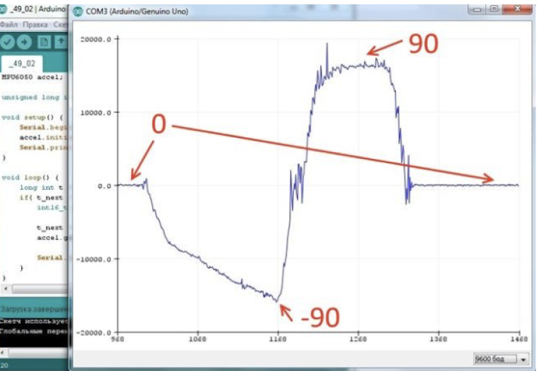

### Mood Board
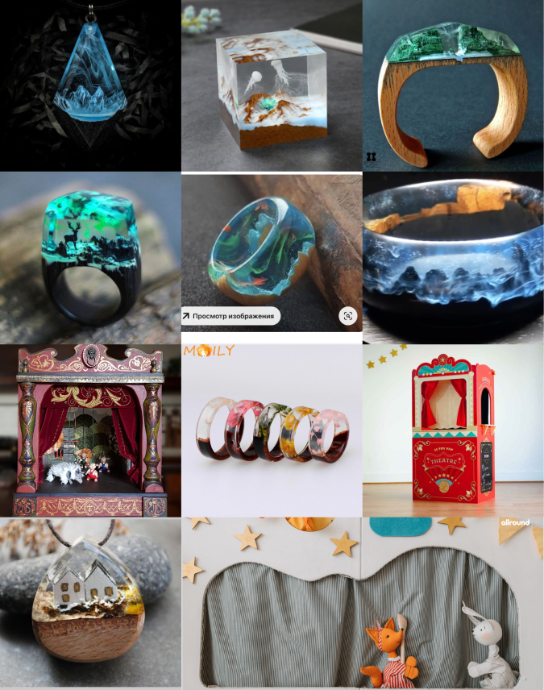

### Sketch of shape
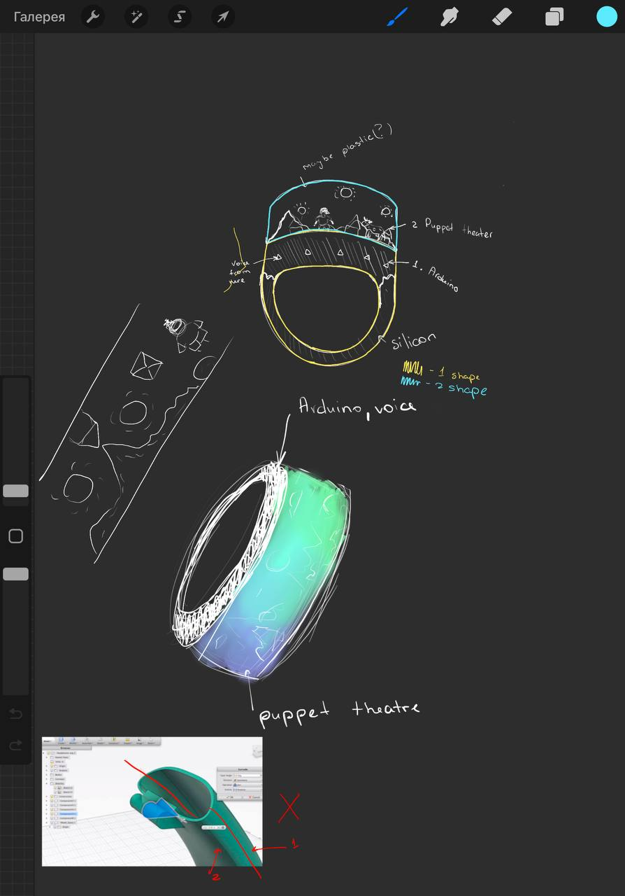

